### Hi there 👋

I'm a full-stack developer based in **Lille, France** 🇫🇷
I prefer the front end, and my favorite language is **JavaScript**.

- 🔭 I'm currently working on web projects with **React**, **Vue.js**, **Node.js**, **PHP** and a game with **Unity 3D**
- 🎮 I'm also active in the **FiveM** community, building frameworks and resources for GTA V modding
- 💼 I'm **open to work** — feel free to reach out!
- 🌐 Check out my website: [deathart.fr](https://deathart.fr)

#### ⚡ My Dev Statistics
<!-- GitHub Stats -->  
  
 

#### ⚡ Languages and Tools:

  

